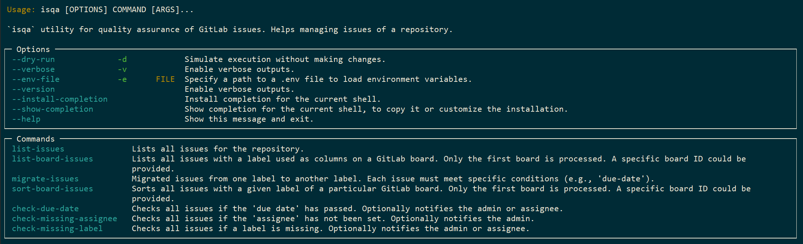

## About

> A CLI utility for quality assurance of GitLab issues. Name `isqa` is comes from merging the term `issues` and `quality assurance `.

`isqa` is a CLI utility designed to help you manage issues of a GitLab repository.

The intended use is to use `cron` or a similar approach to run the CLI in the background with a time interval. For insstance, a version running in th docker can use the following docker job scheduler: [mcuadros/ofelia](https://github.com/mcuadros/ofelia)

## Installation

* (option 1) Clone this repo and follow `development setup`
* (option 2) Directly install (`TestPyPI`)
    ```
    pip install --index-url https://test.pypi.org/simple/ --extra-index-url https://pypi.org/simple/ --upgrade isqa
    ```
* Check `configuration` afterward
    
##  Development Setup

This guide walks through setting up the project for local development using `uv`.

1. Create a new virtual environment in a `.venv` directory and activates it.
    ```bash
    uv venv
    ```
1. Activate the environment (macOS/Linux):
   ```
   source .venv/bin/activate
   ```
1. Activate the environment (Windows):
    ```
    call .venv/Scripts/activate.bat
    ```

1.  **Install Package in Editable Mode**
    Installing the package in **editable mode** (`-e`) is the key to development. It links the `isqa` command in your environment directly to your source code.
    ```bash
    uv pip install -e .
    ```
    
##  Configuration

This tool requires access to your GitLab repository (*scopes*: `api`, `read_api`). It uses a `.env` file to securely load your API credentials.

1.  Create a `.env` file in the root of the project
1.  Add your GitLab URL and a **Access Token** to the `.env` file.
    ```env
    GITLAB_URL=https://gitlab.your-company.com
    GITLAB_PROJECT_ID="Project_Name"
    GITLAB_PRIVATE_TOKEN=Your_Access_Token_Here
    ```
    > **Note:** You can generate a Access Token (AT) from your GitLab repository under **Settings > Access Tokens**. Make sure to check upon creation the following *scopes*: `api`, `read_api`.

    > Never commit your `.env` file to version control.

1. To send notifications via email, a file `extra.env` with email configs is required.
    ```
    cp samples/sample.extra.env extra.env
    nano extra.env
    ```

## Usage

Once installed, the `isqa` command is available directly in your terminal.

**NOTE:** In case you want to work with multiple repositories, then you need to create a multiple `.env` file and pass them to CLI explicitly.

Because it's a typer application, you can explore all its commands and options by simply running:

* Help
    ```
    isqa --help
    ```

Here is a list of examples demonstrating the core features of the utility:

* List board issues
    ```
    isqa list-board-issues --board-name tasks
    ```
* List board issues (without visible labels on the board)
    ```
    isqa list-board-issues --without-labels
    ```
* Use a custom `test.env` file
    ```
    isqa --env-file test.env list-issues
    ```
* Run a check of a due date property of the issues and notify admin via email, if some issues are due
    ```
    isqa check-due-date --notify-admin
    ```
* Run a check of missing labels of the issues and notify admin via email, if some issues got no labels assigned
    ```
    isqa check-missing-label --notify-admin
    ```
* Run a check of missing assignee for the issues and notify admin via email, if some issues got no assignee
    ```
    isqa check-missing-assignee --notify-admin
    ```
* Migration issues from label `In Progress` to label `administration` when condition `due-date` met (issues have been due)
    ```
    isqa migrate-issues --from-label "In Progress" --to-label "administration" --check-condition due-date
    ```
* Sorting the issues on a board within the label `projects` (**NOTE**: it make take a while, because after each `sort` pass, the script will be pause for `10` seconds in order not to overload server )
    ```
    isqa sort-board-issues --label projects
    ```
* Sorting the issues on a board within the label `projects` in descending order.
    ```
    isqa sort-board-issues --label projects --descending
    ```

## CLI UI



## Note

In order to get emails notifications, each user must set his/her email as `public` inside the own profile, or `admin` will be getting the emails.